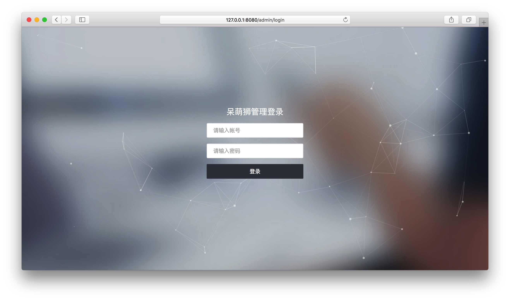
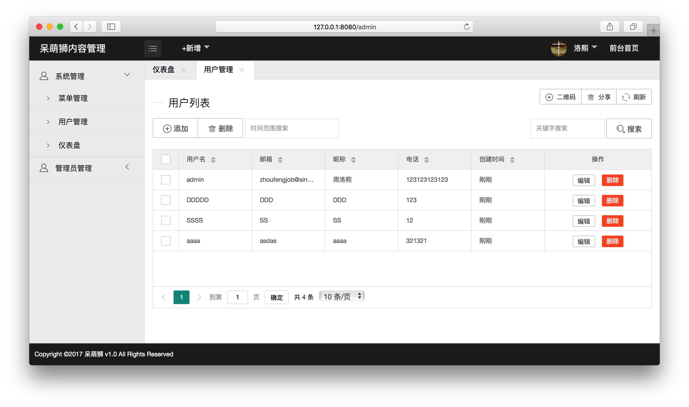
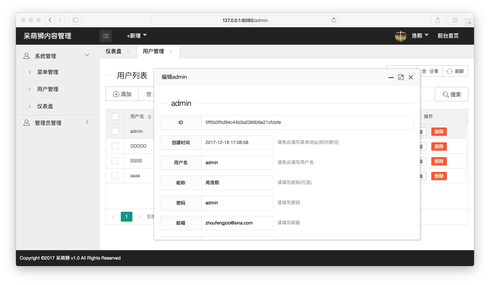
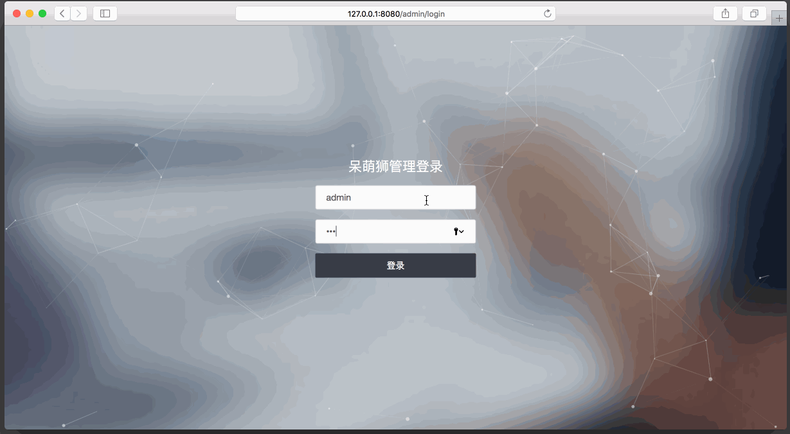
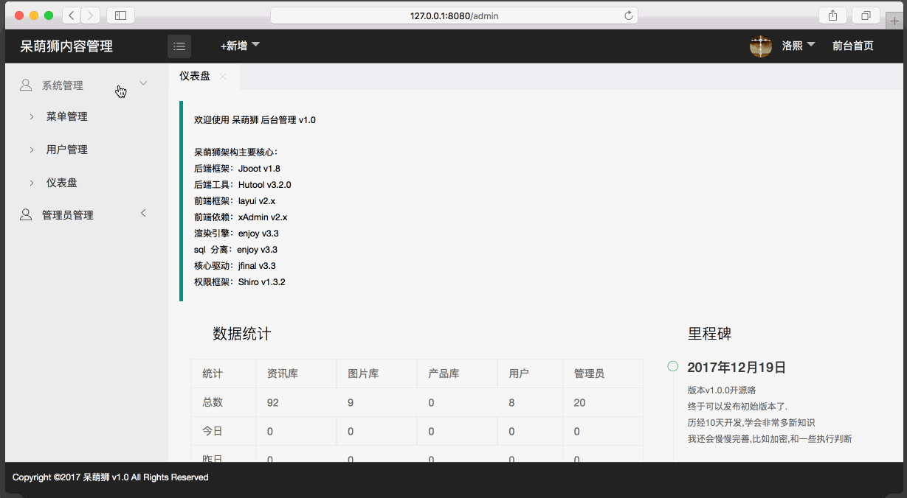
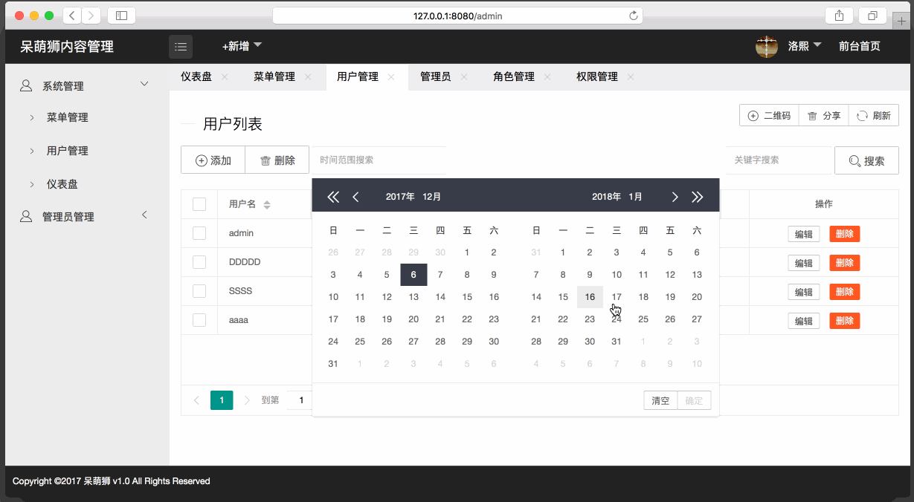
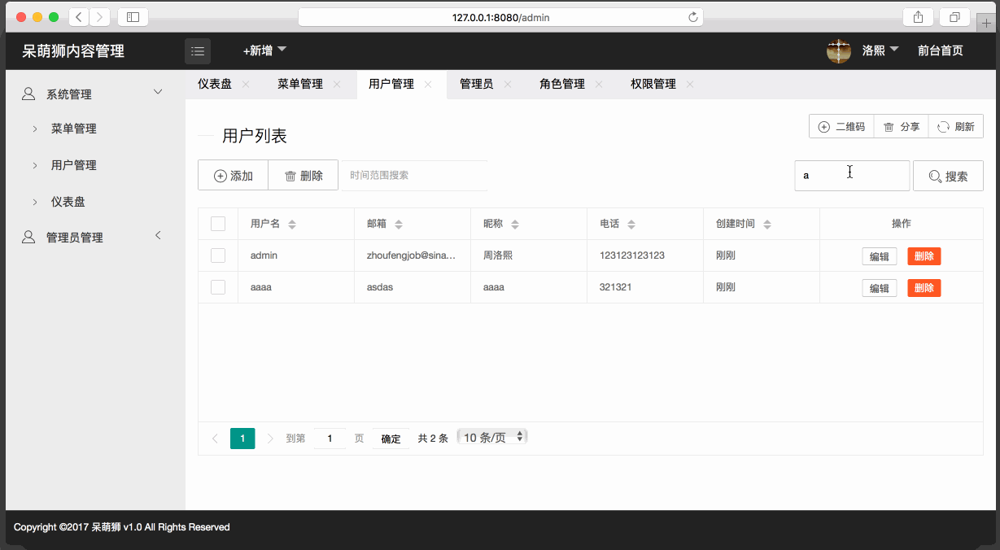
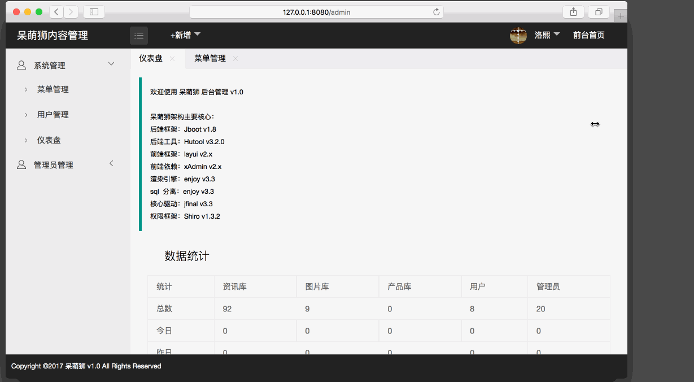

# 呆萌狮内容管理

## 简介
这是一个基于**JBoot**实现的内容管理手脚架。

目前实现了权限管理的部分，

项目讲持续更新，尽请期待。。。


> 感谢jboot、layui、X-admin。本后端基于jboot架构，前端基于layui,X-admin。

##  声明
-  这个项目我站在巨人的肩膀上只用了10天时间完成权限管理v1.0.0
-  我没有webapp开发经验这里所有都是在这10天里面现学现用.在此之前没有接触过jfinal或enjoy.
-  我主要开发android程序,闲下来的时间学习web扩充知识点
-  如果项目中有不合理的地方请理解...
-  如果你有心可以提交发现的问题,大家一起学习...
-  我很喜欢jboot 原因是 上手简单
-  我在jboot官方1群,群号:601440615,欢迎来call

##  将来
我会继续跟新这个项目,利用学到的知识做一个完整的内容管理系统。


##   呆萌狮架构主要核心

核心依赖 | 名称及版本|版本号
---|---|---
后端框架 | Jboot |v1.9.0
后端工具|Hutool |v3.2.0
前端框架|layui |v2.x
前端依赖|xAdmin |v2.x
渲染引擎|enjoy |v3.3
sql 分离|enjoy |v3.3
核心驱动|jfinal |v3.3
权限框架|Shiro |v1.3.2


## 运行方法
1. 使用idea maven导入项目
2. 将docs下的sql导入数据库
3. 在项目根目录找到AppMain类执行Main方法

## 生成jar包方法
使用maven打包**窗口**运行程序:

```
clean package appassembler:assemble
```

使用maven打包**后台**运行程序:

```
clean package appassembler:generate-daemons
```


> 后台登录帐号:admin  
> 后台登录密码:admin

### 静态图展示



### 动态图






